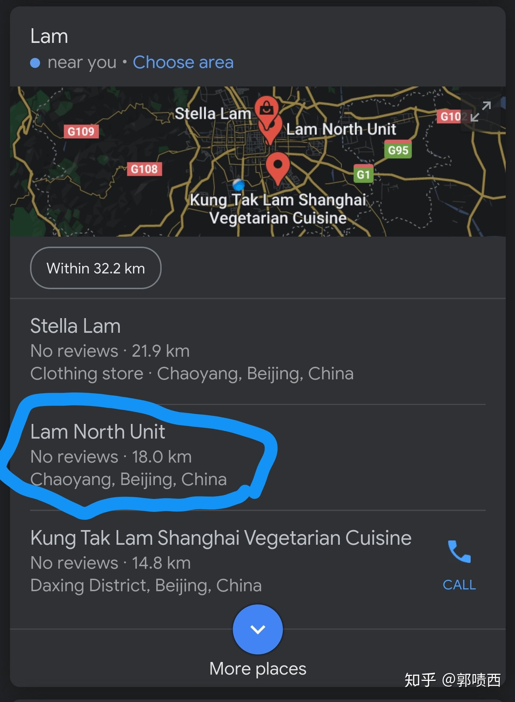

> 作者：郭啧西 (Lammaccat)
>
> 链接：https://www.zhihu.com/question/278388105/answer/1299362373
>
> 来源：知乎
>
> 著作权归作者所有。商业转载请联系作者获得授权，非商业转载请注明出处。

到底是多无聊的人才会在谷歌上搜自己的名字呢？

实在是睡不着…然后发现北京有个地方叫Lam North…

Lam，广东话林的意思，某香港著名人士就叫Carrie Lam 

north是北写成林北，林北是福建话里老子的意思…

算是一个比较有意思的typo吧

