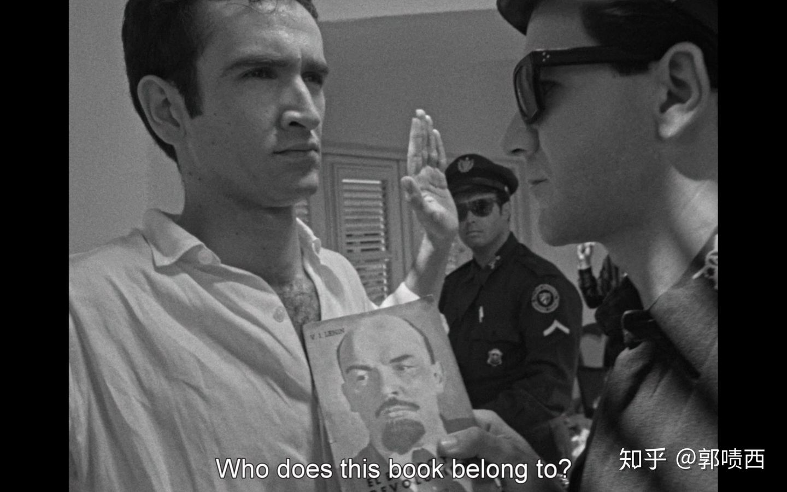
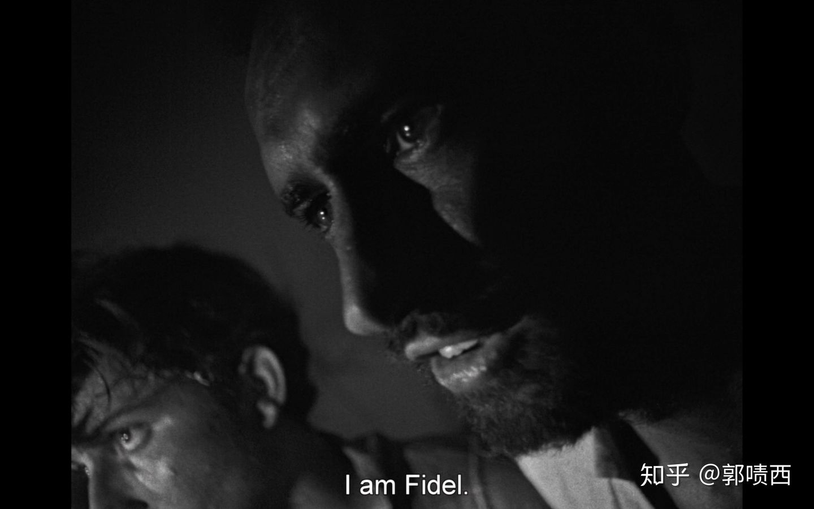
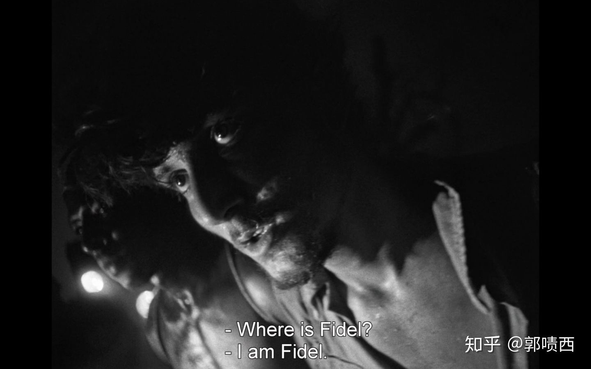
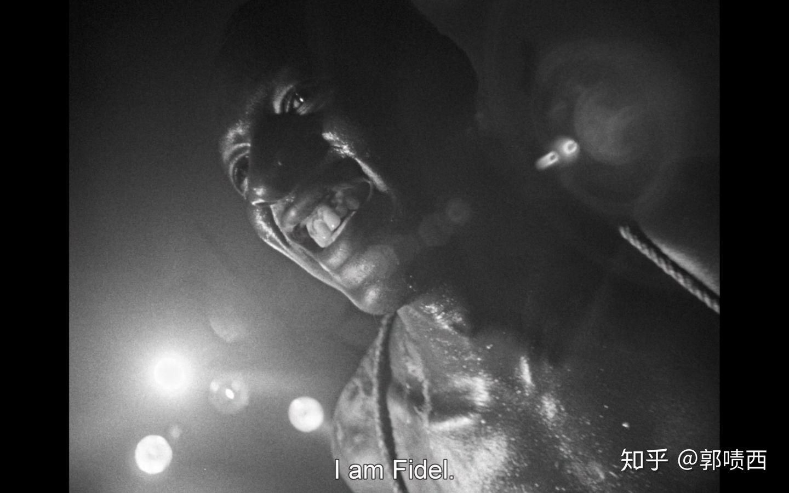
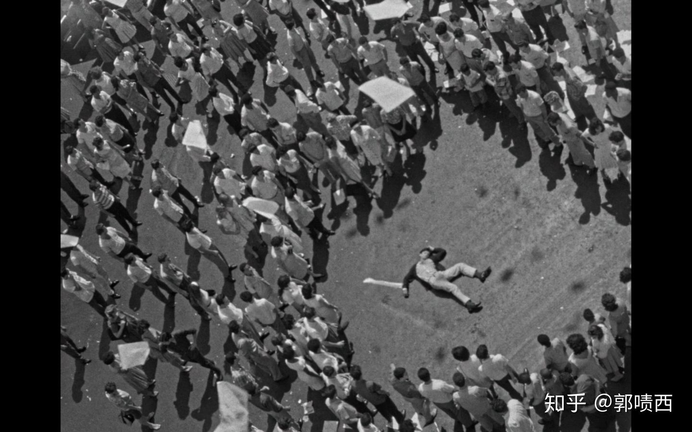
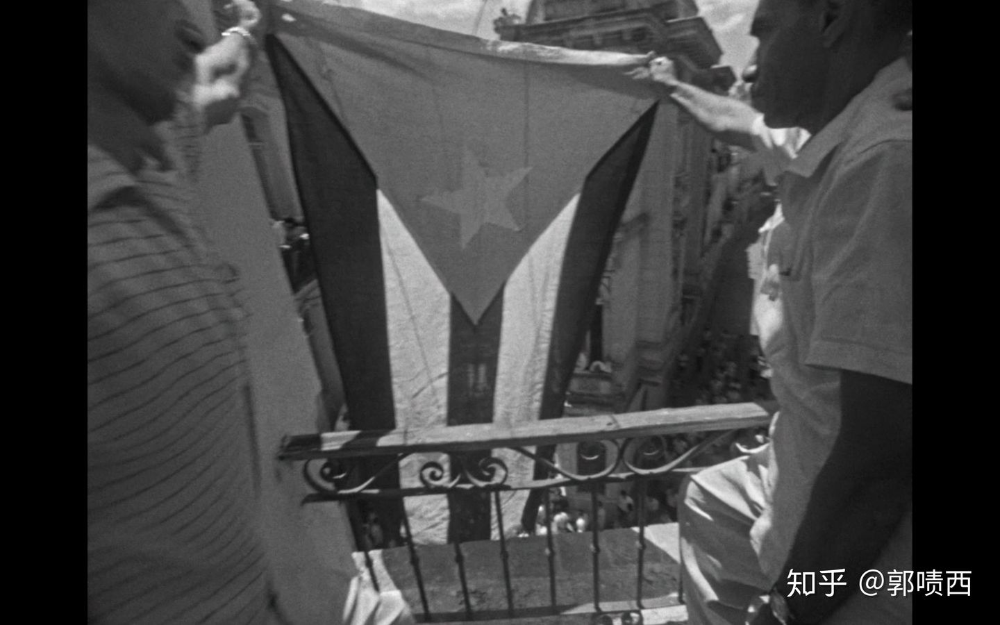

> 作者：郭啧西
> 链接：https://www.zhihu.com/question/317032986/answer/1285641264
> 来源：知乎
> 著作权归作者所有。商业转载请联系作者获得授权，非商业转载请注明出处。

除了那几首诗，基本上每次剧情冲突的台词都令人印象深刻。

从imdb上引用一些：

[Quotes from "Soy Cuba"](https%3A//www.imdb.com/title/tt0058604/quotes/%3Ftab%3Dqt%26ref_%3Dtt_trv_qu)

关于谎言、真相：

> **[Enrique](https://link.zhihu.com/?target=https%3A//www.imdb.com/name/nm0306456/%3Fref_%3Dtt_trv_qu)**: Stop at the University.
>  [*Departs bus and runs up the steps of the University*]
>  **[Enrique](https://link.zhihu.com/?target=https%3A//www.imdb.com/name/nm0306456/%3Fref_%3Dtt_trv_qu)**: They killed Fidel Castro! They killed Fidel Castro! Here it's in the paper. Where's Alberto? Alberto, Fidel Castro has been killed!
>  **[Alberto](https://link.zhihu.com/?target=https%3A//www.imdb.com/name/nm0180959/%3Fref_%3Dtt_trv_qu)**: It's a lie, Enrique. Here's what we need to do. We have to let all Havana know that this is a lie. Fidel Castro is alive. He and his comrades have landed in the Oriente province... And have begun the struggle.

地下活动被查时：

> **Police Officer**: [*Holding a copy of Lenin's "The State and Revolution"*] Who's book is this? Who's book is this!
>  **Student Activist #!**: It's ours.
>  **Police Officer**: Yours?
>  **Student Activist #!**: It's our book. And anybody who hasn't read it is an ignoramus.
>  [*Shot and killed*]
>  **Student Activist #2**: Long live Freedom! Long live the Revolution! Cubans! Fidel lives! He's up in the Sierra Maestra with his comrades! He and his comrades are fighting against Batistia.
>  [*Shot and killed*]

人生的两条路：

> **[The voice of Cuba](https://link.zhihu.com/?target=https%3A//www.imdb.com/name/nm0720952/%3Fref_%3Dtt_trv_qu)**: I am Cuba. There are two paths for people when they are born. The path of slavery - it crushes and decays. And the path of the star - it illuminates but kills. You will choose the star. Your path will be hard, and it will be marked by blood. But in the name of justice wherever a single person goes, thousands more will rise up. And when there are no more people, then the stones will rise up. I am Cuba. When men are born, there are two paths. You will choose the star... The path will be hard, and it will be marked by blood.

我们都是卡斯特罗(X命者)：

> **Soldier**: Where is Fidel?
>  **Captured Revolutionary #1**: Fidel? I am Fidel.
>  **Soldier**: Where is Fidel?
>  **Captured Revolutionary #2**: I am Fidel!
>  **Captured Revolutionary #3**: I am Fidel.

------

如果说印象深刻的情节，还是那场葬礼，本来就一直在酝酿情绪，再加上导演摄影师炫技，一下子就打动内心了。

葬礼cut好像在b站也有呢。