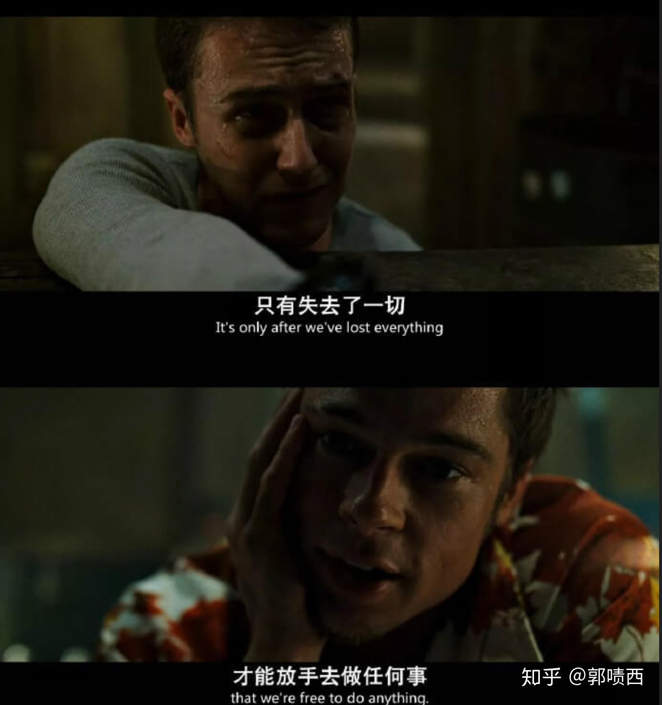
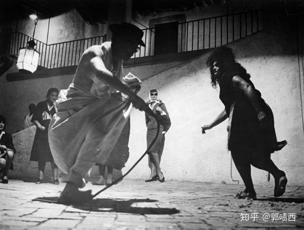
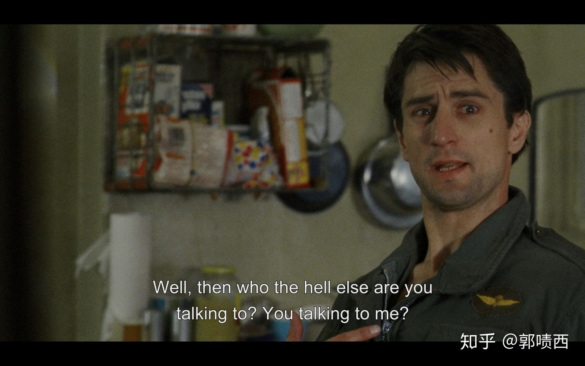

> Author: Anonymous

# 《做题家自我解脱三步法》

第零步：明确纲领

做题家自我救赎的关键在于明确目标。只有有了明确的目标，我们才能知道自己想要什么，要如何实现。

可以有躺平、实现财富自由或者成为资本家（难度太大）、揽炒、研读圣经《中庸》。

第一步：主动跌入谷底

只有卢瑟到极点才能触底反弹，是做题家达成自我救赎的充分条件。

手动调高亮度

而跌入卢瑟谷底的方法之一就是，做最多的题，卷更多的人。只有我们成为奋斗逼鲤鱼精，才能实现做题家自我救赎的必要前提：财富自由。

没办法，这是资本家的圈套。你改变不了它，但你可以利用它的规则。

第二步：完成自我觉醒

在这一步中，我们要意识到自己之前的内卷

自我觉醒的形式有多种。

或是拒绝再学习生化环材、量子力学、计算机科学，

或是夜里梦见电子羊惊醒，

或是细品久失清洗的空调里吹来的黄曲霉，或是创作赛博朋克小说，或是发表键政暴论，

[如果我们其实生活在脑后插管的赛博世界，你还会继续留在这个世界里内卷吗?](https://www.zhihu.com/question/400536167)

或是与人对线互骂（云搏击俱乐部）

或是探索存在主义

或是抱着浅色床单痛哭流涕

浅色床单

在月光下痛哭流涕

但尽管形式多样，我们仍不应强求快速达成自我觉醒，因为自我觉醒的精髓在于顿悟，而不是取得为了觉醒而觉醒的illusion

第三步：实现自我解脱进而达成自我救赎

不管你的目标是躺平、成为资本家、揽炒、或是研读《中庸》，只要达成了必要前提、充分条件，我们就能实现自我解脱。

我们只是实现了自我解脱，却没有实现「救赎」中的"赎"。因此，我们要赎罪，要赎自己内卷半生的罪。要把《做题家自我解脱三步法》宣传出去，让更多的做题家达成自我救赎。