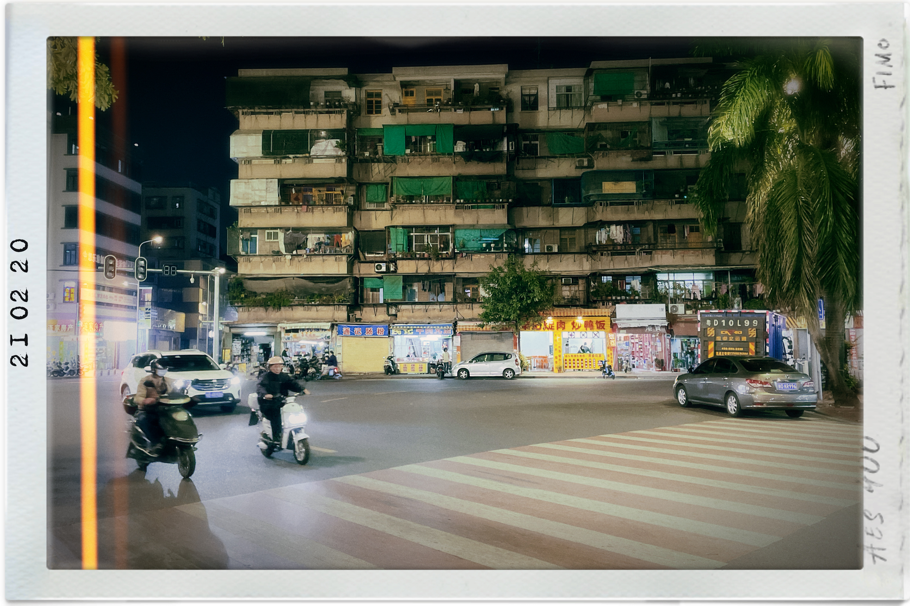

# Tale of the Swatow Maotowqia Boy 汕頭靚仔

> Poem Written in the Style of John Keats
>
> Author: [Lammaccat](https://www.instagram.com/lammaccat/)
>
> Date: March 2021
>
> Latest Update: May 2021

The moto man stands by his Maotowqia
Under the faint sun, numbly and drowsily 
A salty wind in summer strokes his memory 
Drawing him to Swatow by the melodious sea
Where the endless river flows people’s dreams Into the ocean forever and ever, generation by generation
With beaded bubbles winking and exploding

The moto boy once stood on the stage
With the tender lights which were brighter
Where he flew out the music by plugs on the string
Ah-John hid behind his guitar
Pouring out his passion and energy
Soft wind rustles the maple leaves 
The music drifted to his ears
And found a path for him into the sea breeze 
Then he had nothing but his guitar

The moto man stands in the hall
Induced by the reality magnet
Time has taken away his dream 
Money has tied him to the ground
So the summer froze and the strings ceased
Only buzzing machines but no music echo on his ears
Since he faded away to this sleepless world of steel

The moto man stands by the assembly line
Now his music broken into dust in the wind
Memories have wandered off like writing in the endless river
No company but his light-colored sheet when awakening with tears
Only melancholy seems to be eternal
The drink of memory blushes him
With foamed bubbles winking and exploding

---

## Original Version with Pictures

## Interpretation

*This interpretation is originally written in Chinese. The following content is a translation of my interpretation.*

At first, I wrote this poem to have fun by writing about the chaotic yet iconic appearance of motorcycles[0] (Maotowqia) in a 18th-tier city[1] of Guangdong, Swatow[2]. As a result, it was written into a completely different poem with I initially wanted. I didn't even describe the Maotowqia[3].... So it turned into writing that a person who used to be a rotten boy/ghost fire boy[4] became a worker and losed all his life meaning. You may that the writing style between sentences is very unharmonious, and the story is not clear. Well that's because this was my AP English assignment which I needed to submit on last minute.

Although I didn't think about it when I wrote it, when I look at it NOW, I must have been subconsciously inspired by some works when I composed this poem.

To begin with, I think this poem is strongly inspired by a rock song [*Kill That Man from Shijiazhuang*](https://youtu.be/xbq-_2TqHVQ) by [Omnipotent Youth Society](https://en.wikipedia.org/wiki/Omnipotent_Youth_Society) and epic juvenile-crime film [*A Brighter Summer Day*](https://www.criterion.com/films/28596-a-brighter-summer-day) by Yang De-chang (AKA [Edward Yang](https://www.imdb.com/name/nm0945981/)). OYS's *Killing That Man from Shijiazhuang* tells the story of an unemployed worker who is unable to adapt to society, while *Guling Street Juvenile Murder* describes the story of an idealist teenager's concept of the world gradually collapsing. Although finding a job opportunity in real life is actually better than staying in the Chaoshan hometown, in my poem, getting a job for the Shantou/Swatow people is miserable. Moreover, their life is sacrificed for work, and their past life is gone,  just like the people in this song and movie: they are all mentally dead.

Then there is a song from the Wutiaoren's [*Walk a Pig on My Bike*](https://youtu.be/D0LdgY3hVrI) from [*Some Other Scenery*](https://music.douban.com/subject/10738197/). It seems that this song is banned in Chinese streaming platforms. It describes the iconic Maotowqia scene in [Haifeng](https://en.wikipedia.org/wiki/Shanwei), which is also a small city in eastern Guangdong like Shantou) crazily driving all over the city, and discontent with the prohibition of motorcycles in Guangdong.

Finally, I was under influence by a miserable poet, Xu Lizhi, who was also from Chaoshan/Teoswa in Guangdong. He worked at Foxconn[5] in Shenzhen and committed suicide when he was 24 years old. A lot of his poems describe his worker life.

> "I Swallowed a Moon Made of Iron..."
>
> (translated by Google and revised by myself)
>
> I swallowed a moon made of iron
> They call it a screw
> I swallow the this industrial waste water, the jobless orders
> Those youths below the machine come to a premature end
> I swallowed the hustle and bustle of rushing crowds
> I swallowed destitute and homeless nights
> Swallow the pedestrian bridge, swallow the life covered with rust
> I can't swallow anymore
> Everything I have swallowed is now surging from my throat
> Paved into an anthem on the territory of the motherland
> Into a poem of shame

> "Heart Buried in Life"
>
> (translated by Google and revised by myself)
>
> Don't you want to endure it
> Eyelids are already heavy as a mountain
> He tried to lift his body in the dark
> Whenever the tearful starlight pouring down the wind
> His lean body always trembles
> The teenage years disappeared in chagrin
> There is one snow left, one after another, one after another dream, the flames he tasted are all cold
> And the worn skin is like a bed of rags
> The faith that spreads out in the wind of the years can no longer find a direction
> Together with his heart buried by life
> A heart deeper than the ocean

This article on Zhihu introduced him: https://www.zhihu.com/question/339919577/answer/1709056112

If possible, I really want to make this a BiGan/Tarkovsky/Hou Hsiao-Hsian/JiaZhangke style, or Kusturica style movie.

In fact, I feel a little disgusted with the imagination and romanticization of specific places. For example, Tibet. I think if you romanticize an underdeveloped place, people will ignore its miserableness and underdevelopment. We don't need a lot of praise; they are already enough. Instead, I want to dig deeply on the harshness of people living there. 

Last, please FOLLOW the traffic rules.

---

Notes for Non-Chinese Audience:

[0] : In southern China, motorcycles are major vehicles due to geographical reason. Motorcycles are favored by workers as they are cheap, but Chinese government has banned use of motorcycles by workers in most cities, as the gov considers motorcycle is a sign of underdevelopment. The government bans it by setting an extremely difficult requirement for holding a motorcycle.  

[1] : In Chinese, we call a city with lower economic performance as a "#th-tier city."

[2] : Swatow, or Shantou, is a crucial city of the [Teoswa/Chaoshan](https://en.wikipedia.org/wiki/Chaoshan) area. In China, Chinese has **various** linguistic and cultural forms other than Madarin Chinese or Cantonese Chinese. However, due to the government's resistance on presenting cultures of the minorities, people may not know much about this small cultural-linguistic region of China. Teoswa/Chaoshan people has known for their character which is hard to explain, and I will update about their culture later. After 1980s, the Teoswa/Chaoshan area, like Swatow/Shantou in the poem, became extremely poor for several political and economic reasons. The city always operates in economic depression since then, you can see it is very depressed and poor from this [video](https://youtu.be/vT0l5BR-Mz0). Most city residents cannot find jobs, so they can only find simple factory jobs in big city like Shenzhen. In China (and many other developing economies), workload and working condition in a factory are ANTIHUMAN, and that's why the story of this poem happens. Although it was an important industry town back in 1980s, it is now only known for its [cuisine](https://youtu.be/7ZKJPmq8ehc). Click blues for more info if you'd like to do so.

[3] : Maotowqia represents the pronuciation of "motorcycle" in local Swatow language. 

[4] : In local Swatow language, we call a boy "rotten boy" if he is not a "good and obeying" boy. "Ghost Fire Boy" is often used by adults to describe the "rotten" boys who like generating noises from driving motorcycles.  

[5] : Foxconn is a manufacturing giant in Shenzhen, where most Swatow people go for jobs there. This company manufactures iPhones for Apple, and it is notorious for extremely harsh working conditions and workload.

---
*This following content is my original Chinese interpretation*

写的时候一开始是想娱乐下，写广东十八线城市的摩托车（猫托恰/Maotowqia）到处乱窜、杂乱无章的样子。结果写着写着内容往奇怪的走向，连猫托恰都没描写....变成了写一个曾经是烂仔/鬼火少年的人变成了打工人....然后句子与句子之间会文风很奇怪不搭，故事也没怎么说清楚，因为我最后一天为了赶快把作业交上去随便写写的....

虽然写的时候没有怎么想到，但是现在再看，写的时候肯定潜意识里或多或少受到过一些文艺作品的启发。

先是万能青年旅店的《杀死那个石家庄人》和杨德昌拍的《牯岭街少年杀人事件》。万青的《杀死那个石家庄人》讲述的一名失业工人无法适应社会的故事，而《牯岭街少年杀人事件》描写的是一名理想的人对世界的认知逐渐破灭的故事。虽然现实里找到打工机会其实比待在朋克的潮汕老家好，但是在我写的东西里，汕头靓仔因为生活去打工，跟这条歌和电影里面的人们一样：都精神上的死了。

然后就是五条人的一只歌《踏架单车牵条猪2012》 《一些风景》专辑里的。国内的音乐平台好像搜不到。它描写汕尾海丰（和汕头一样都是粤东闽南语系小城市）的猫托恰满天飞，和对广州禁摩的不爽，但是我为了赶作业根本没有写猫托恰....

再然后是谭的电视节目。这个节目记录了人生百态。

最后就是一个很悲的诗人，许立志，也是广东潮汕人，在深圳富士康打工，后来24岁时跳楼自杀。他的诗有很多在描述自己的工人生活：

> 「我咽下一枚铁做的月亮……」
> 我咽下一枚铁做的月亮
> 他们把它叫做螺丝
> 我咽下这工业的废水，失业的订单
> 那些低于机台的青春早早夭亡
> 我咽下奔波，咽下流离失所
> 咽下人行天桥，咽下长满水锈的生活
> 我再咽不下了
> 所有我曾经咽下的现在都从喉咙汹涌而出
> 在祖国的领土上铺成一首
> 耻辱的诗

> 「被生活埋葬的心」
> 还要不要隐忍下去
> 眼皮早已沉重如山
> 他的头试着在黑夜里抬起
> 沾满泪的星光就瓢泼而下风一起，他单薄的身躯总要抖几抖
> 少年时光在懊恼中离去
> 剩下一场雪，纷纷，纷纷梦里，他品尝到的火苗都是冰冷的
> 而磨损的皮肤像一床破绵絮
> 摊开在岁月的风里固有的信念再找不到方向
> 连同他那颗被生活埋葬的
> 比海洋更深的心

这一篇知乎介绍了他：https://www.zhihu.com/question/339919577/answer/1709056112

如果有可能，我多想把这个弄成一个毕赣风格，塔库夫斯基风格的电影，侯孝贤风格的，贾樟柯风格的，库斯图里卡风格的电影。

还有一些想说的。个人其实有点反感对特定地方的想象、浪漫化。我觉得把一个不发达的地方浪漫化，人们就会忽略到它的不好、落后，就会忽视掉它的很多问题。我们不需要很多赞美。

最后，请大家遵守交通规则。
