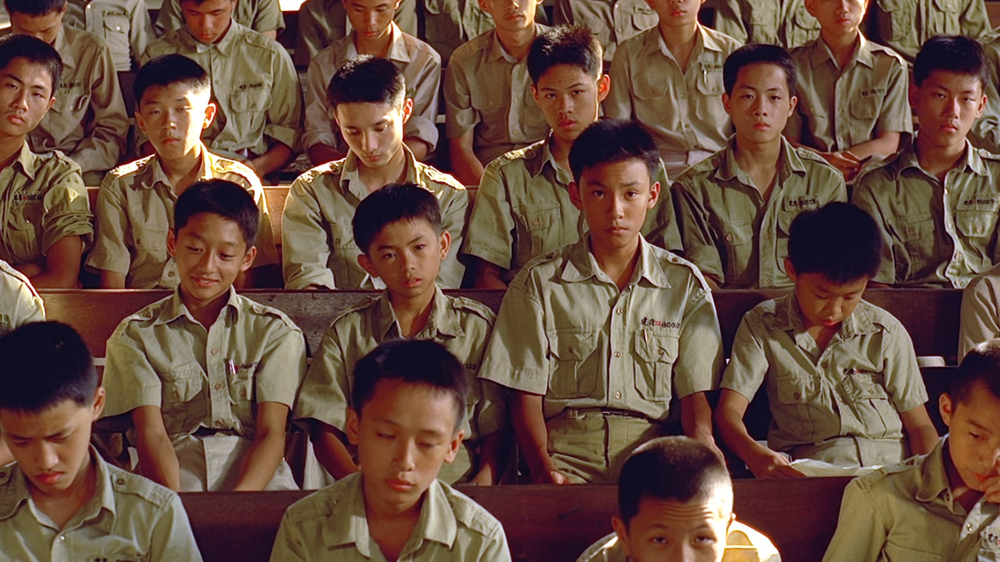

> Author 作者：[Lammaccat](https://github.com/LamMacCat/)
>
> First Update 首次更新：24/03/2021
>
> Latest Update 上次更新：05/20/2021

- [**Story小故事**](https://github.com/LamMacCat/Human-Society/tree/main/Story%E5%B0%8F%E6%95%85%E4%BA%8B)
- [Poetry诗](https://github.com/LamMacCat/Human-Society/tree/main/Poetry%E8%AF%97)

- [Photography Artwork摄影](https://github.com/LamMacCat/Human-Society/tree/main/Photography-Artwork%E6%91%84%E5%BD%B1)
- [Idea/Thinking/Contemplation/Random Thoughts/Free Writing/随想/散文](https://github.com/LamMacCat/Human-Society/tree/main/Idea-Thinking-Contemplation-RandomThoughts-FreeWritin-%E9%9A%8F%E6%83%B3-%E6%95%A3%E6%96%87)

# Human Society 麥記人類士多

## Introduction 项目简介 

**HumanSociety 麥記人類士多**是一个社会实验性质的写作宇宙。它可以是一个诗歌项目，一个文学项目，是任何一个你想让它成为的项目。它有许多个项目分支，有诗，有随笔，有文学，有记忆，有任何你想提交的内容。

它是一个浪漫主义的行为艺术，是一个五十年后可以被收录进在火星的人类文明博物馆的项目。它通过文字与图片，来赞美自然：夏日微风、树梢的麻雀、南极的企鹅。你可以自由表达你对政治议题的看法，亦或是对全球变暖的关切。它赞美生活，凝聚思考，留下记忆。这些都被编入不同的分类中。截止最后一次更新，我们有小说、小故事、摄影、诗和随想五个分类。

它的野心很大。任何人群任何背景任何语言，来自所有年龄段的人，都可以在这里发表他们的写作，亦或者记录他们真实的想法与思考。结合GitHub的丰富功能，人们可以简单实现**保留历史版本**、**纠错上报**、**创立分支**等功能。比如，这个项目的fiction部分可以拥有创造性的叙事结构：你可以创建平行宇宙，于此同时，共同协作创作一篇小说。

## Background Story 背景

在你半梦半醒时，缓慢不连续的思绪是否为你最近的生活谜题带来启示？你是否会在炎热的午后，睡眼惺忪的想起与家人曾度过的一个晚上？当你盼到了阳光明媚的春天，蒲公英和柳絮飘到躺在草坪上的你，你是因被打扰而愠怒，还是赞美自然？面对人类的种种难题，你是否会感到捶胸顿足、无力且绝望？

---

不知道从哪里说起，于是我打算思维混乱地讲故事。浏览这个项目，你也会注意到这是我（这个项目其中的一个contributor）的主要文风。

古诗词在中国文化/文学里占有崇高的地位，因此中国学生自小就接受古诗词教育。从小学时，我就“学会”了一千年前的诗人望见异乡明月时的苦闷，他们对于亲人的思念，对于人生和存在的思考，以及种种古诗词常见的主题。

但是，我却很少"沉浸"在这些诗里，很少与那些诗人产生共情；我对那些作品的理解，仅仅是一串串文字的组合。现在再重看那些作品，全都是杰作，但为何激不起我内心的波澜呢？究其原因，是我不够认真对待它们。我没有认真地去尝试理解它们，而只是机械式的背诵他们以应付考试和成绩。

转机出现在我的AP Language课程上。我需要主动去做搜索项目（research project）来研究诗歌。于是我不能再把它们当成文字的排列组合了；我需要好好地体悟他们。当我认真地去研读、共情那些文字背后的情感时，我真正地感受到了诗的魅力。对于诗是什么，我想用塔可夫斯基的话来总结："When I speak of poetry I am not thinking of it as a genre. Poetry is an awareness of the world, a particular way of relating to reality. So poetry becomes a philosophy to guide a man throughout his life."

不管是narrative opacity，迷幻的想法，还是真实生动的描写，都在吸引着我。我也找到了自己大学时想做的一件事：用诗的语言记录自然风光。

---

*A Brighter Summer Day*是我最喜欢的电影之一。它描绘了在1960年代政治高压下的躁动青少年群像。通过四个小时的时长，它生动地展现了那个时代的人们的生活，并为我们带来反思。看下面这张图，你能感受到电影角色们透过凝视为你带来的触动。后来在2月份左右，我在课上读了《麦田里的守望者》。这本书没有精美的语言，但它精确的反映了那个年代的青少年的困境与思考。

我受到启发：如果有一个项目，能记录来自所有人的想法、声音，那不就是一部更加宏大充实的著作吗？

为了实现这个目标，我开创了这个项目。它托管在GitHub平台，因为它可以实现人人协同。

## Story Behind the Name 名字含义

英文名其实很好理解。中文名有些玄机。士多，在粤语中，是store的音译，意为“杂货铺”。而什么什么记，在粤语中就是某位人士开的一家店，就像英文里的xxxx's一样，比如麦当劳。所以"麦记"就是一个叫麦的人开的杂货铺。

## How to Publish Your Own Work 上传

Rules Ver. 1.0

我们鼓励所有人来加入到这个项目当中，但有一些规则需要注意。

1. 目前这个项目作品的主要语言为中文和英文，但你的语言选择并不受限制。
   - 但为了人们的理解，我们强烈鼓励你加入英文注解。
2. 我们不会限制脏话的使用
3. 如果你会使用GitHub，请联系Lammaccat将你加入collaborator权限，来直接使用它。或者创建branch之后提交pull request
4. 你可以提供你想要的署名、日期

## Future 项目展望

为了让这个项目成为一个真正的去中心化、属于所有人的写作宇宙，最终这个项目会被编入一个区块链数据库。这也是我的大学研究目标之一。

## Contact 联系项目负责人

项目负责人为：[lammaccat](https://github.com/LamMacCat/)

你可以通过GitHub来联系项目负责人。

## Contributor Acknowledgement 鸣谢

For those who contribute to the **Human Society 麥記人類士多**, you will be on the acknowledgement list.

贡献过**Human Society 麥記人類士多**这个项目的人会出现在下列鸣谢清单当中：

0. Anonymous
1. [Lammact](https://github.com/LamMacCat/) (Lam Miao-miao)
2. Mr. Fucku
3. 郭啧西 (Gwok Jaak-hai) (Another myself)
4. 李大约 (Li Big Yue)
5. 鲁迅嫡传大弟子
6. 黑库姜津子川岛芳子 (Another myself)
7. 渣女 (Bad Girl)  
